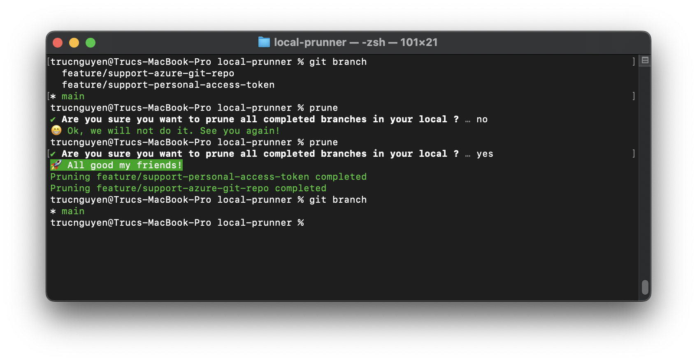

# ✂️ Local Prunner
Super tiny CLI to prune your completed branch in your local

## Build
```
cd local-prunner
npm run build
```

## Install

```
cd local-prunner
sudo npm link
```

Restart your terminal and run ```prune``` or ```prune ~/workspace/git-repository-directory```



## TODOs
- [x] Prune completed branches in local
- [ ] Support private repository

## Limitation
Support only public repository at the moment